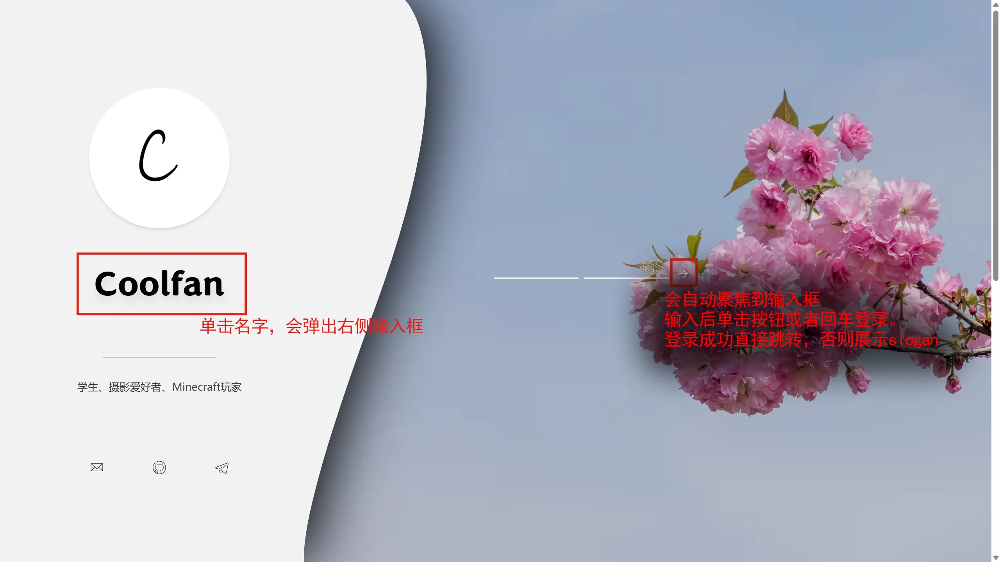
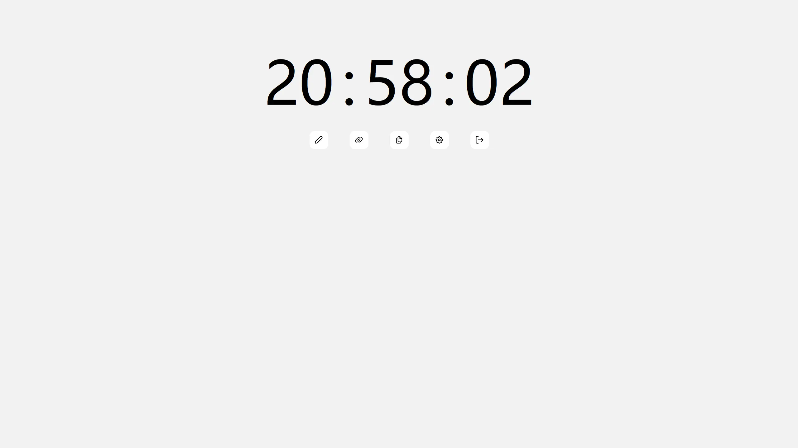
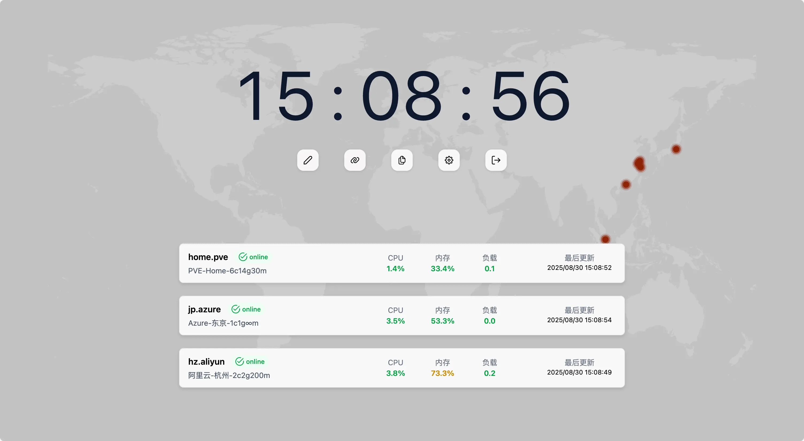
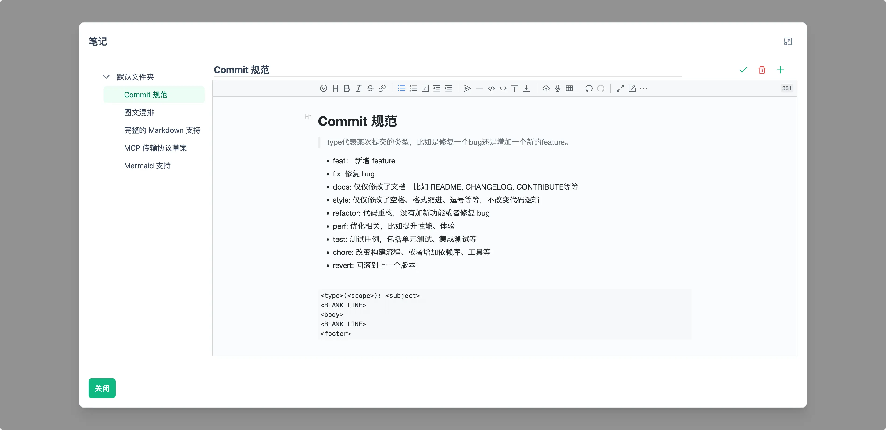
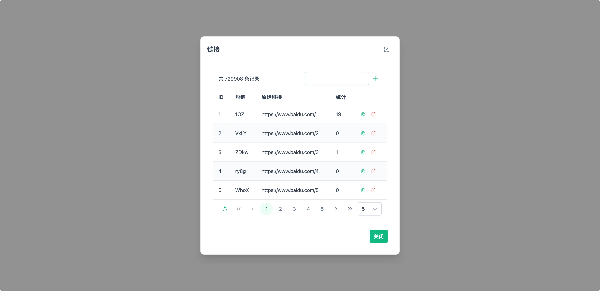
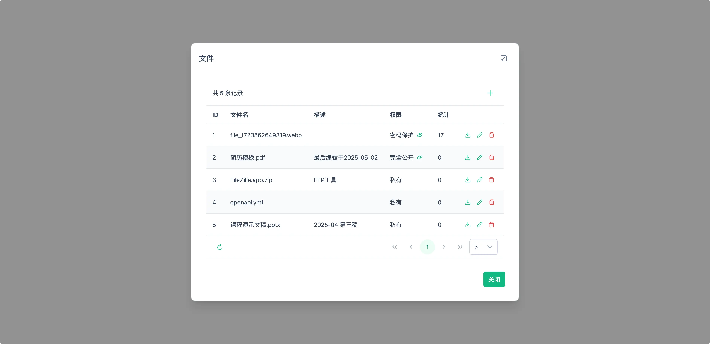
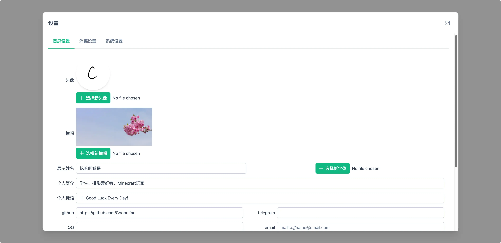
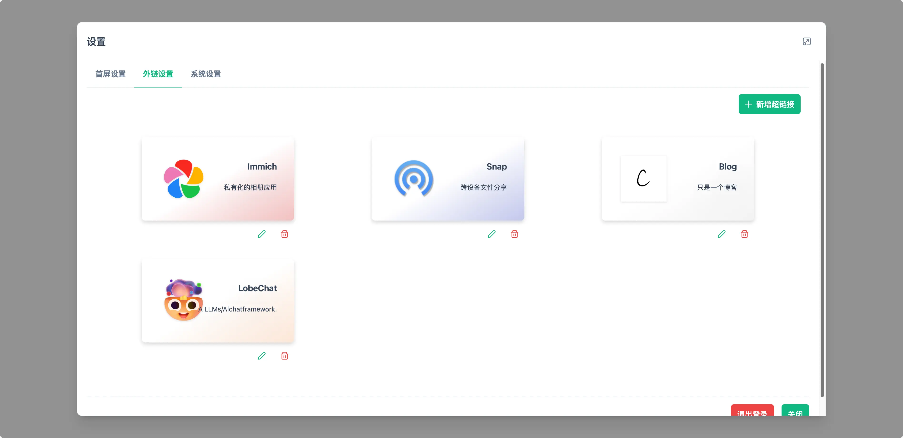
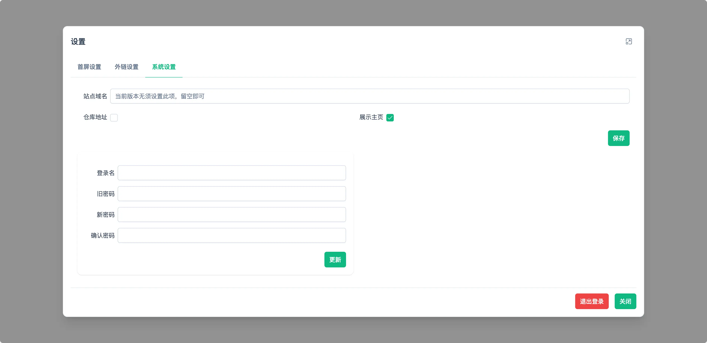
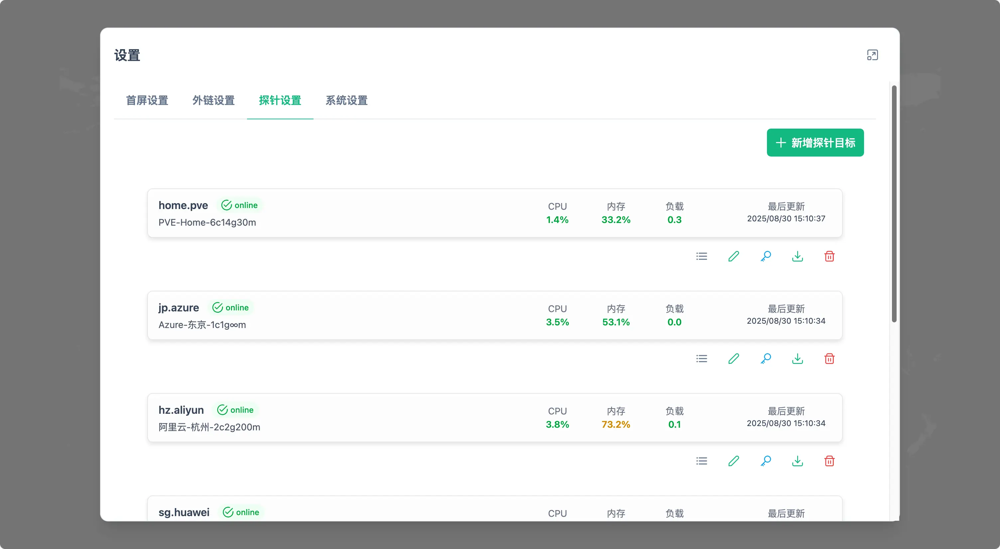

# UniBoard

个人主页 + 导航页 + 笔记 + 短链接 + 文件分享

此仓库仅为前端页面代码，使用 Vue + TS + Primevue + Tailwind CSS 构建。[后端仓库地址点此访问。](https://github.com/Coooolfan/UniBoard-Service)

## 功能介绍

- 首页个人信息与横幅展示
    - 所有内容可编辑
    - 允许完全隐藏
- 导航页的外链展示与跳转
- 账号密码登录
    - 在主页单击名字，账号密码输入框会弹出
- 云笔记模块
    - 支持 Markdown 语法
    - 支持所见即所得编辑
    - 自带图床服务
- 短链服务
    - 统计
- 文件
    - 存储
    - 分享
    - 直链下载
    - 鉴权
- 全局暗色模式支持

## 截图

### 着陆页




### 主页



or




<table>
    <tr>
        <td></td>
        <td></td>
    </tr>
    <tr>
        <td></td>
        <td></td>
    </tr>
    <tr>
        <td></td>
        <td></td>
    </tr>
        <tr>
        <td></td>
    </tr>
</table>


### 文件分享页


## 部署与安装

### Docker Compose

1. 下载`.env`文件和`docker-compsoe.yml`文件

    ```shell
    mkdir uniboard
    cd uniboard
    wget https://github.com/Coooolfan/UniBoard/releases/latest/download/docker-compose.yml
    wget https://github.com/Coooolfan/UniBoard/releases/latest/download/example.env
    ```

2. 按照需要修改`.env`文件和`docker-compsoe.yml`

    1. `docker-compsoe.yml`：默认只暴露`8888`端口（文件第6行），通过此端口向外暴露所有服务，如果您需要对`uniboard`配置反向代理，只需代理此端口即可。
    2. `.env`：按照提示修改即可，切记要修改`POSTGRES_PASSWORD`的值，**不要使用默认值!**
    3. 修改完成后复制`example.env`为`.env`文件,供`docker compose`服务调取

        ```shell
        cp example.env .env
        ```

3. 使用`docker compose`命令启动服务

    ```shell
    docker compose up -d
    ```

4. 使用浏览器访问站点，默认为`8888`端口，如果您在本机部署，访问`http://localhost:8888`即可

### 使用Nginx配置反向代理(可选)

Uniboard程序本身不提供ssl相关功能，直接暴露8888端口不是一个好的选择。

考虑到不同环境下Nginx的配置可能并不相同，下文仅提供思路和必要配置。

1. 创建对应站点的conf文件

2. 编辑监听的server_name, ssl相关内容

3. 配置反向代理

    ```conf
    client_max_body_size 0; # 设置最大包大小为无上限
    location / {
        proxy_pass http://127.0.0.1:8888;
        proxy_set_header Host $host; # 保留代理之前的host
        proxy_set_header X-Real-IP $remote_addr; # 保留代理之前的真实客户端ip
        proxy_set_header X-Forwarded-For $proxy_add_x_forwarded_for;
        proxy_set_header HTTP_X_FORWARDED_FOR $remote_addr; # 在多级代理的情况下，记录每次代理之前的客户端真实ip
        proxy_set_header X-Forwarded-Proto $scheme; # 表示客户端真实的协议（http还是https）
        proxy_redirect default; # 指定修改被代理服务器返回的响应头中的location头域跟refresh头域数值
        proxy_buffering off; # 禁用缓存，确保始终从后端获取最新内容
    }
    ```

4. 让Nginx重新加载配置

    ```shell
    nginx -s reload
    ```

## 升级

> [!CAUTION]
> 0.3.0 版本与以前版本**完全不兼容**，重写了整个后端服务。当您尝试“升级”到 0.3.0 及以上版本时，需要删除原所有内容，从0开始。

程序会尝试兼容旧版本的数据库。在**跨多个版本升级**时，建议先浏览 Releases 或者 [更新说明页面](./upgrade-guide.md)，查看每个版本的更新内容，以及可能的数据库变更和破坏性更新。

**不建议使用各种自动升级工具。**

如果您使用上述的 Docker Compose 方式部署，可以通过以下命令升级并重启：

```shell
docker compose pull && docker compose up -d
```

## API

可见：<https://uniboard.apifox.cn/>

### 与文件相关的API说明

1. 上传文件

    `POST /api/file-record`：上传文件，参数为[`FileRecord`对象](https://github.com/Coooolfan/UniBoard-Service/blob/main/src/main/kotlin/com/coooolfan/uniboard/model/FileRecord.kt)，其中的`share_code`字段会被忽略，由服务器生成。返回新增成功的`FileRecord`对象，包含生成的`share_code`字段。注意上传时使用`multipart/form-data`格式，以携带二进制文件。

1. 编辑文件信息

    `PATCH /api/file-record/<int:file_id>`：编辑文件信息，参数为[`FileRecord`对象](https://github.com/Coooolfan/UniBoard-Service/blob/main/src/main/kotlin/com/coooolfan/uniboard/model/FileRecord.kt)，返回修改成功的`FileRecord`对象。如果要修改文件的`file`字段，需要使用`multipart/form-data`格式，以携带二进制文件。

2. 获取文件列表

    `GET /api/file-record`：获取文件列表，返回[`FileRecord`对象](https://github.com/Coooolfan/UniBoard-Service/blob/main/src/main/kotlin/com/coooolfan/uniboard/model/FileRecord.kt)列表。（此方法需要鉴权）

3. 获取文件下载直链

    `GET /api/file-record/direct-link/<int:file_id>`：获取文件下载直链，返回一个UUID。使用`5`中的API，替换`<str:UUID>`为UUID即可。获取的地址在5分钟后会失效。（此方法需要鉴权，对所有文件可用）

4. 使用API直接下载文件

    1. 此API不需要鉴权，对于无效密码或者UUID均返回404。(wget下载时需要加上`--content-disposition`参数)

    2. `GET /file/<str:UUID>/`：使用此API直接下载文件，`UUID`为`4`中返回的UUID。此API不需要鉴权，对所有文件有效。
 
    3. `GET /file/<str:share_code>/?pw=<str:password>`：使用此API直接下载**非私有文件**，`share_code`为文件的`share_code`字段，`password`即为文件设置的密码，**密码参数可选**。
   
    4. 部分客户端默认不支持使用content-disposition设定文件名，您可以在路径最后加上文件名来为这些客户端提供文件名。比如`localhost/file/UUID/文件名`或者`localhost/file/share_code/文件名`。其中`文件名`不参与任何服务端的逻辑，仅用于客户端显性显示文件名。对于密码保护的文件，需要在路径中加上`?pw=文件密码`。例如`localhost/file/i2S3/sky.png?pw=123456`，这样可以直接下载`share_code`为`i2S3`的文件并显性地告知客户端文件名为`sky.png`，其中密码为`123456`。

## For Development

TODO

## Star History

<picture>
  <source
    media="(prefers-color-scheme: dark)"
    srcset="
      https://api.star-history.com/svg?repos=Coooolfan/UniBoard&type=Date&theme=dark
    "
  />
  <source
    media="(prefers-color-scheme: light)"
    srcset="
      https://api.star-history.com/svg?repos=Coooolfan/UniBoard&type=Date
    "
  />
  
</picture>
